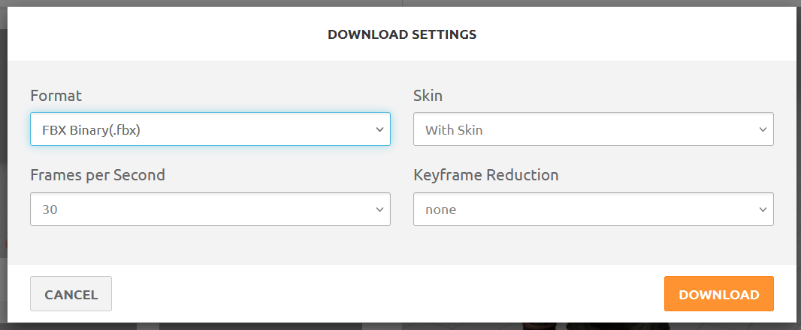
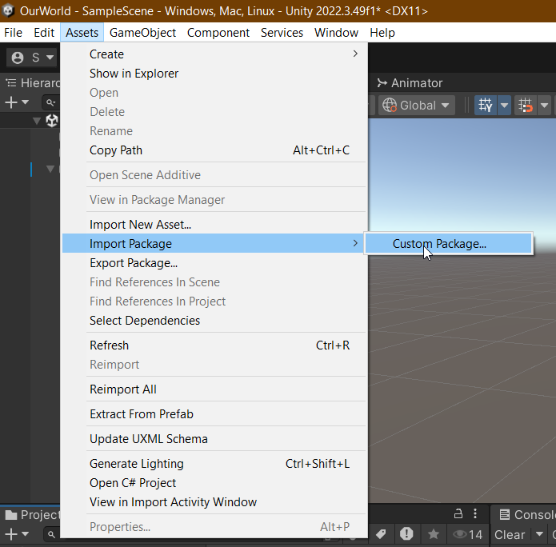
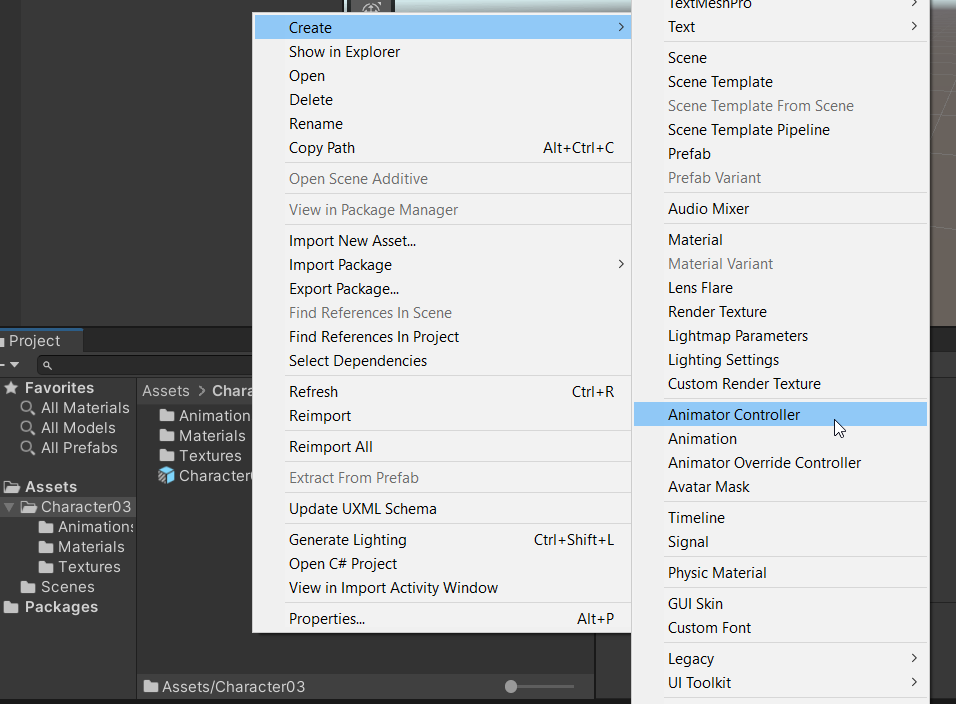
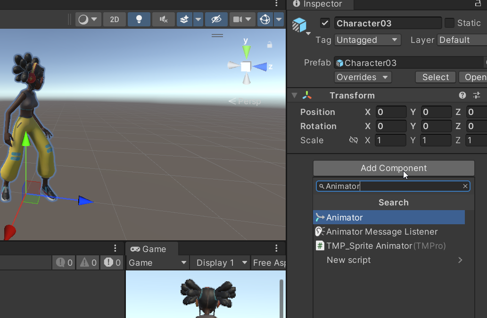
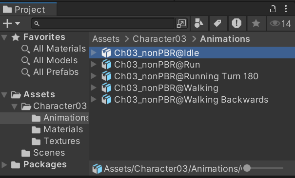
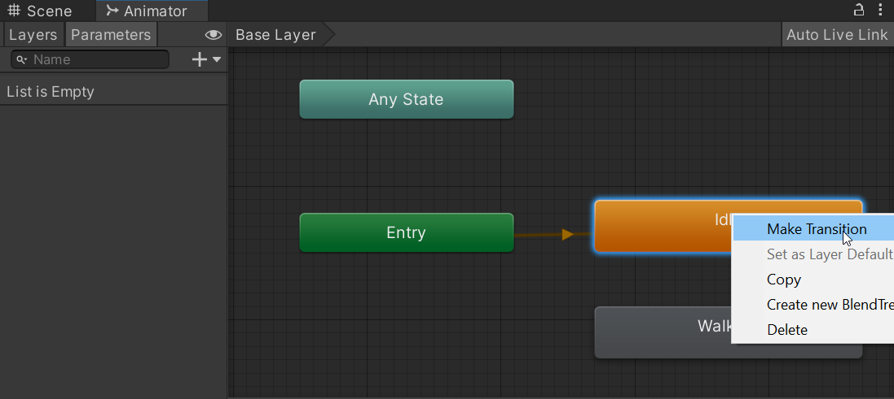
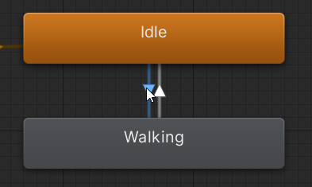
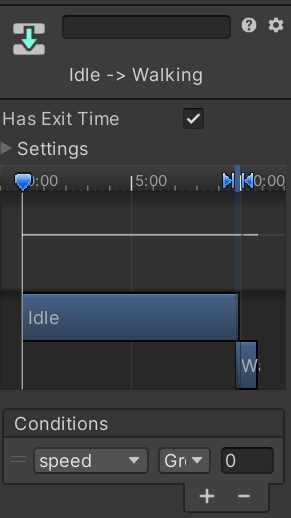

# 3D Animaties in Unity

## Voorbereiding
Nodig: 
* Unity3D
* Een model
* Idle animatie
* Loop of run animatie

Het model en de animaties kan je downloaden via Mixamo.com. Dit is een website met enkele 'stock' 3D modellen en animaties. 

Voor een makkelijk begin, download deze package. 

### Package importeren
Een package importeer je als volgt.



## Animator Controller toevoegen aan 
Sleep jouw model in de scene.
We kunnen deze niet direct animeren. Om de animaties aan te sturen (en heel veel andere leuke dingen te doen) gebruiken we een `Animator Controller`. 
Klik met de rechter muis in jouw project window en maak een `Animator Controller` aan. 


Om de animator controller toe te voegen aan het GameObject, moeten we een `Animator` component toevoegen aan het object. 

We kunnen onze `Animator Controller` hangen aan de `Animator` door deze erin te slepen, in het vakje naast de label *Controller*.

## Animator Controller
De Animator Controller bepaalt wanneer welke animaties afgespeelt gaan worden. De eerste animatie die je er in sleept zal gebruikt worden als start punt. Dubbel klik op jouw `Animator Controller` om het *Animator* window te openen. Sleep de **Idle** animatie er in.

Als je nu op play drukt, zal jouw character de animatie af spelen.
### Problemen
Het kan wezen dat de __idle__ *animatie* niet herhaalt (loopt). Ga in de projectwindow naar de idle animatie. 

Vink je vakje achter **Loop Time** aan. 

## Lopen
Als we ons character willen laten lopen dan moeten we als eerst de *walk* animatie toevoegen. Sleep deze in de animator window. Om van **Idle** naar **Walk** animatie te gaan moeten we een transitie maken. __Rechtermuisklik__ op **Idle** en kies __Make Transition__. (Linkermuis)Klik op de **Walk** animatie blok.

De (Walk) animatie wordt nu uitgevoerd zodra de idle animatie klaar is. Dat willen we niet. We willen dat de walk animatie afgespeeld wordt wanneer ons character naar voren loopt. 

## Animator aansturen
We gaan onze speler aansturen. Dat moeten we doen door middel van code. Maak een script genaamd *PlayerMovement*. Knal de onderstaande code in dit script. Belangrijk is dat de naam van het script hetzelfde is als de naam van de class (**PlayerMovement**)
```C#
using System;
using System.Collections;
using System.Collections.Generic;
using UnityEngine;

public class PlayerMovement : MonoBehaviour
{
    public float movementSpeed = 4;

    /*
        Hier komt het volgende blok code
    */
    void Update()
    {
        Vector3 movement = new Vector3(0, 0, 0);
        if (Input.GetKey(KeyCode.W))
        {
            movement += transform.forward * movementSpeed * Time.deltaTime;
        }
        if (Input.GetKey(KeyCode.S))
        {
            movement -= transform.forward * movementSpeed * Time.deltaTime;
        }
        transform.position += movemesnt.normalized * movementSpeed * Time.deltaTime;
    }
}
```

## Parameters
Welke animatie wanneer uitgevoerd wordt, gebeurt op basis van de parameters van de `Animator`. Klik in de __Animator__ window op de *Parameters* tab. Nu kunnen we __Parameters__ aanmaken. 
Er zijn 4 verschillende parameters die gebruikt kunnen worden.
* Triggers: Worden gebruikt voor animaties die 1x uitgevoerd worden. Bijvoorbeeld een sprong of een dans animatie. 
* Boolean: Wordt gebruikt voor iets wat true of false is. Bijvoorbeeld om te kijken of een speler midden in de lucht is.
* Float: Gebruik ik voor bijvoorbeeld de snelheid van een speler.
* Int: Heeft ook usecases. 

Voor het bewegen van de speler, maak een **float** parameter met de naam `speed`. 
Klik op de Transitie van **Idle** naar **Walk**. 


Hier kan je conditions aanpassen wanneer de deze transitie verloopt. Druk op het plusje, en stel in dat transitie moet gebeuren wanneer *speed* groter is dan 0. 
Has Exit Time staat aan, zet deze uit. 



Druk op play. De walk animatie speelt nu af wanneer de snelheid groter is dan 0. Dit kan je ook testen door deze parameter aan te passen in de Animator editor. 

## Code 
De parameter van de Animator kan je aanpassen in de code. Zet de volgende code __boven__ de Update functie. 

```C#
   //Het animator component wordt hier gedefinieerd. 
    //Hierdoor kunnen we deze in verschillende functies in de class gebruiken.
    private Animator _animator;

    void Start(){
        //Het animator component wordt uit het object opgehaald.
        _animator = GetComponent<Animator>();
    }
```

We hebben nu toegang tot de animator. Om onze parameter in de Animator aan te passen, pas de volgende code aan.

```C#
if (Input.GetKey(KeyCode.W))
{
    movement += transform.forward * movementSpeed * Time.deltaTime;
    _animator.SetFloat("Speed", 1);
}
```